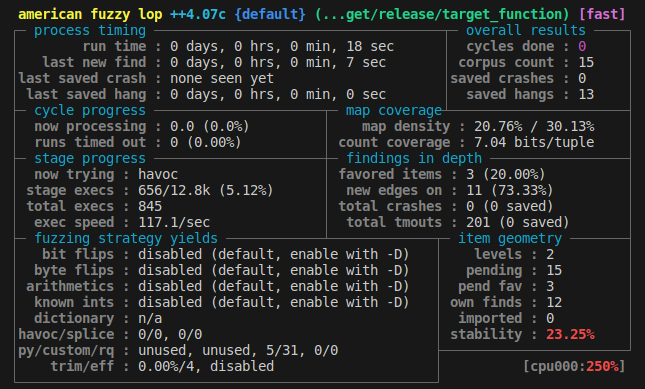

# Tic Tac Toe Game using libAFL
This is a simple implementation of the Tic Tac Toe game written in Rust, and it is being fuzzed using [libAFL](https://github.com/AFLplusplus/libAFL) (American Fuzzy Lop - A fuzzer).



## Fuzzing with libAFL
The Tic Tac Toe game is being fuzzed using libAFL, which is a popular fuzzing engine for finding bugs and vulnerabilities in software applications. In this case, the fuzzing process is generating random inputs and feeding them to the game to explore different execution paths and identify potential issues

## Fuzzing Configuration
* Seed Inputs: Three seed inputs have been provided to the fuzzer to start the exploration process.
* Execution Timeout: The execution timeout for each input is set to 20 milliseconds (exec_timeout: 20).
* Fuzzing Metrics:
    Total Cycles Done: 0
    Corpus Count: 101
    Saved Crashes: 0
    Saved Hangs: 31

## Usage
Follow the steps below to test the target function using libAFL:

Clone the repository:
```shell
git clone https://github.com/HakaKali/libAFL.git
  ```

Change to the repository directory:
```shell
cd repository
  ```

Build the project:
```shell
cargo build --release
  ```    

Prepare the input file for libAFL:

1. Create an input file with the desired input for testing. For example, you can create a file called input.txt and add the input hello, world to it.

2. Run the target function using libAFL:
```shell
cargo afl fuzz -i afl_input -o afl_output target/release/target_function
  ```
Replace input.txt with the path to your input file and target/release/repository with the path to the compiled target binary.

Monitor the fuzzing process:

libAFL will start fuzzing the target function with different inputs, including the ones in your input file. Monitor the process and check the findings directory for any discovered issues.

## Additional Notes

* The provided code snippet is a simplified example for demonstration purposes. Adjustments may be required based on your specific use case.
* Ensure that libAFL is correctly installed and configured prior to running the fuzzing process. Consult the libAFL documentation for installation instructions and further information

## License

This project is licensed under the [MIT License](link-to-license-file). Feel free to use, modify, and distribute the code in accordance with the license terms.

## Contact
For any questions or inquiries, please contact [Email me](mailto:your-email@example.com).
